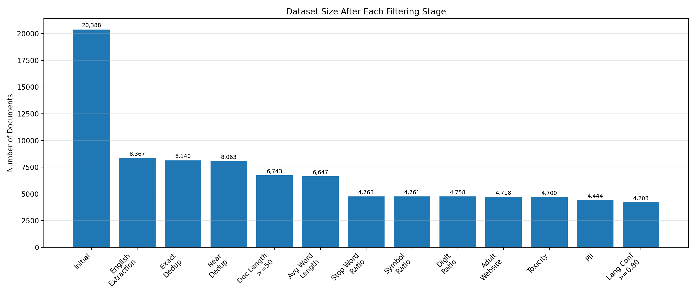

# LLM Full Stack Engineering: From Data to Serving the Model (First Project)

## Building a Pre-training Data Pipeline

Data quality is one of the highest-impact parts of the stack.

CommonCrawl is a crawler that has been crawling the web since 2008. It is a massive open source library of the internet — every month its CCBot scans billions of pages and archives them. It offers data in three formats (WARC, WAT, WET). We start our pipeline from WARC files (to have better control, since WARC files are the rawest form, containing full HTTP responses) whereas WAT and WET file formats are filtered versions derived from WARC.

## Document Ingestion

Now, if we consider a particular crawl — for example CC-MAIN-2026-25, which was the latest crawl at the time of doing this project (meaning it was the 25th crawl of 2026) — we download the `warc.paths.gz` file from their website. It contains the paths to 100,000 files (these are not the websites themselves). Each WARC file contains roughly 20k-30k records (rough number), which are the actual websites.

Document ingestion basically means that from raw WARC files we need to prepare something like this for each record:

```
{url: , timestamp: , warc_record_id:, http_status:, content_type:, charset:, html: }
```

After this first step we have a `document_ingestion.jsonl` file, so that we can use these details later. Our main focus will be on what's inside `html`.

A raw HTML response looks something like this:

```
[<!doctype html>
<!--[if lt IE 7]><html class="no-js lt-ie9 lt-ie8 lt-ie7" lang="en-US" ...
... (full raw HTML page content, including head metadata, scripts,
    navigation, ads, article body, comments form, footer, JSON-LD, etc.) ...
</body></html>]
```

This is not the pure text we need — we need to extract only the text from this. To do this, we use the **Trafilatura** library.

## Trafilaturation

The above raw HTML becomes something clean, like:

```
[Game Description
Basketball Shooter is an addictive online basketball game that challenges players to showcase
their accuracy and precision in shooting hoops. Your goal is to make as many successful shots
as possible within the given time limit. With its simple yet engaging gameplay, Basketball
Shooter is the perfect game for basketball enthusiasts and casual gamers alike.

Game Controls
Mastering the controls in Basketball Shooter is key to achieving a high score. The game offers
straightforward controls:
- Mouse: Use your mouse to aim and adjust the angle of your shot.
- Left Mouse Button: Click the left mouse button to shoot the basketball.

...(remaining cleaned article sections)...]
```

The difference is huge — this library is also used in the preparation of modern datasets like FineWeb. After trafilaturation, we only need the text; we don't need the raw HTML anymore, so we replace the raw HTML with the extracted text. After this second step we have the file `text_extraction.jsonl`.

## Language Identification

We need to do this only after text extraction. For language identification there are a couple of libraries to use — I have used the **fastText** library, which outputs the language and also something called `language_confidence`, which illustrates how confident the classifier/language identifier is that the actual language matches the language it outputted. After this step we have the file `language_identification.jsonl`.

Now we only need text that is in the English language. At this step we need to consider both the language and the language_confidence, but in my pipeline I have only considered the language — i.e., if the language is `en`, I have considered it valid for training, without considering `language_confidence` at this stage. Later I will remove the documents that have low `language_confidence`.

## Deduplication

There are two major types of deduplication:

- **Exact Deduplication** — Two documents are byte-to-byte identical.
  Example: "Hello world", "Hello world"
- **Near Deduplication** — Documents are similar but not identical.
  Example: "Python is amazing.", "Python is amazing!"

Modern pipelines do both exact deduplication and near deduplication.

**Exact dedup:** We first hash both documents using the SHA-256 algorithm, then remove a document if it shares the same SHA-256 hash as any other document.

**Near deduplication:** We use something called shingles — for the text "The cat sat on the mat", the 3-word shingles become `{The cat sat, cat sat on, sat on the, on the mat}`. Each document is represented as a set of shingles, and two documents are considered similar if they share many shingles. So we generate shingles for the two documents we want to compare and compute the Jaccard similarity: (A ∩ B) / (A ∪ B).

However, each document may have thousands of shingles — if we're comparing millions of documents, we can't store the shingles for each one. For that we use something called **MinHash**: instead of storing 5,000 shingles for each document, it stores around 128 or 256 numbers per document. We can do this because there is a mathematical result stating that the probability of two documents having the same minimum hash value equals their Jaccard similarity.

But if we want to compare billions of documents, we still can't compare MinHash values pairwise, since that could become ~10^18 comparisons. For that we use **Locality Sensitive Hashing (LSH)**, which tells us which pairs of documents are worth comparing.

Let's understand MinHash and LSH in more detail:

**MinHash:** Say we create a MinHash object like this:

```
mh = MinHash(num_perm=128)
```

Initially the MinHash signature is 128 large numbers (infinity):

```
[∞, ∞, ∞, ......]
```

Now, when we pass one shingle of a document — say `{'the cat sat'}` — we compute the hash of this shingle using 128 different hashing algorithms, and we replace the current number only if `hash = min(hash, current_number)`. So the signature becomes something like:

```
[48192, 912, 87123, ......, 5531]
```

We then pass the next shingle and hash it using the same 128 hash functions, replacing the current value only if the new hash is lower. After processing all shingles, the final set of hashes is what we call the **signature** — this is the 128-integer signature generated using MinHash.

**LSH:** LSH splits this 128-integer signature into bands — say, 32 bands, each containing 4 integers. It hashes these four integers together; suppose the resulting number is `#5267`. If some other document, when its corresponding band is hashed, also produces `#5267`, then these two documents fall into the same bucket.

LSH says that two documents become **candidate pairs** if they land in the same bucket in at least one band — meaning they are only worth comparing using Jaccard similarity. Documents in the same band may actually have low Jaccard similarity, or documents that don't share any band may have high Jaccard similarity — LSH only gives rough candidate pairs to compare, not exact matches.

## Quality Filtering

Now we only keep records satisfying certain conditions, such as `min_document_length`, `max_document_length`, `average_word_length`, `stopword_ratio`, `symbol_ratio`, `digit_ratio`, and several other filters, in order to extract only high-quality text suitable for training. In my data pipeline, I have implemented the filters mentioned above.

## Adult Websites Removal

This step should ideally be performed right after document ingestion, but in my pretraining data pipeline I perform it after quality filtering. For this, I have used the `born-appetite/porn-domains` list, which contains a continuously updated list of adult website domains. I removed the websites that contain adult content, based on their URL domain.

## Toxicity / Policy Filtering

There is a library called **Detoxify** that identifies whether text contains toxic content, threats, or identity attacks. I removed the documents that contain any of these.

## PII Detection

PII detection means checking whether a document contains personal information such as phone numbers, email IDs, driving license numbers, passport numbers, etc. — we don't want to include this either. For PII detection, I used the Microsoft **Presidio** library.

## Filtering Based on English Confidence

This should ideally have been done earlier, while removing other languages, but I do it now: I keep documents where the English confidence is ≥ 0.80 and discard the rest. 0.80 is generally used as an industry standard.


