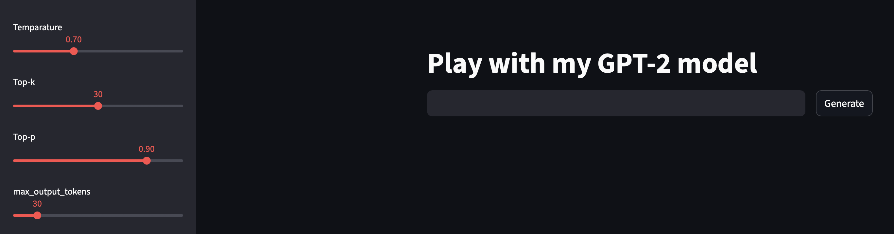
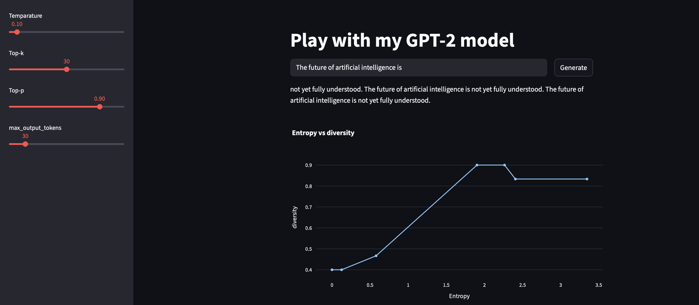

# GPT-2 Sampling Dashboard

Interactive dashboard to experiment with GPT-2 decoding strategies and observe how sampling parameters affect model behavior.

## What This Project Does

- Generate text from a trained GPT-2 checkpoint
- Tune temperature, top-k, and top-p interactively
- Measure average token entropy per generation
- Measure output diversity (unique tokens / total tokens)
- Plot entropy vs diversity while sweeping temperature
- Observe repetition under near-greedy decoding (low temperature)

---

## Streamlit UI

---

## Greedy / Low-Temperature Decoding (temp=0.1) and Entropy vs Diversity

---

