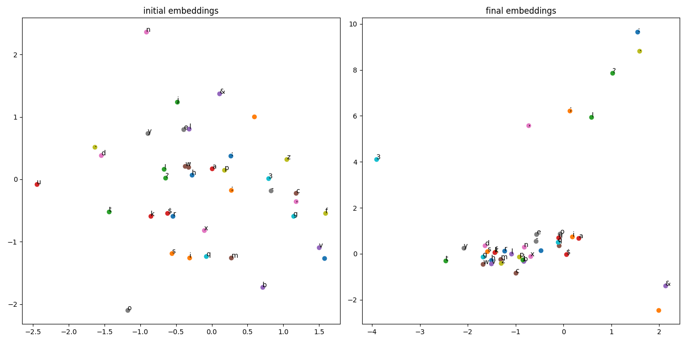
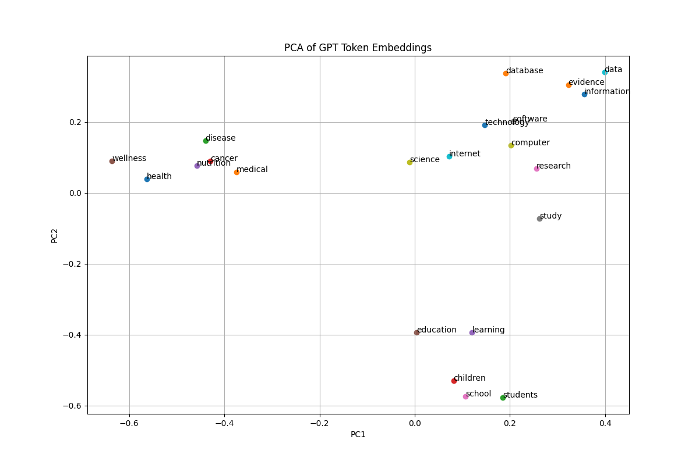
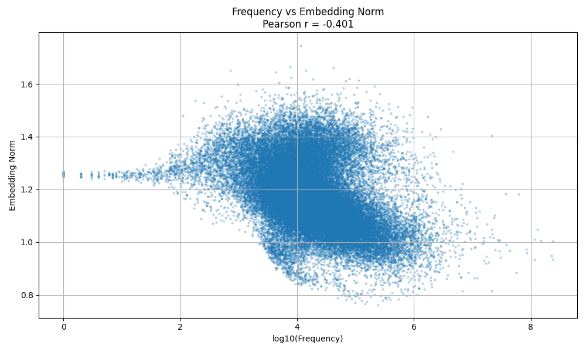
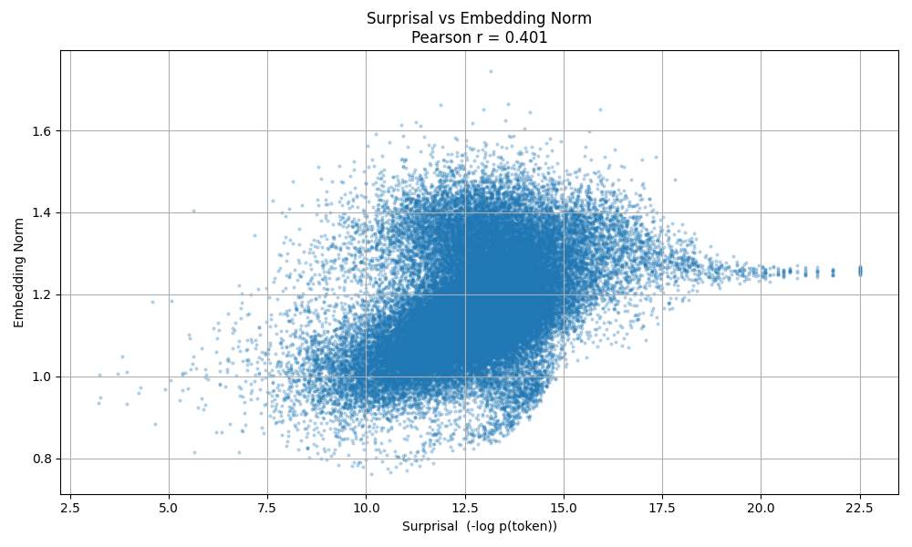
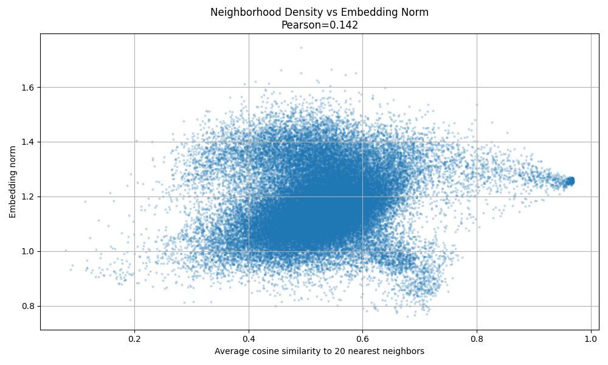
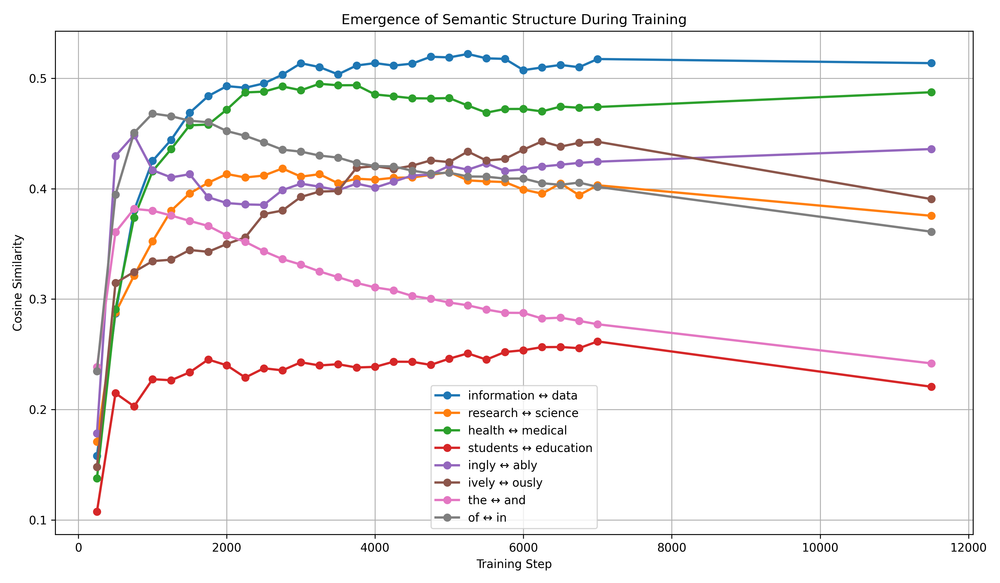
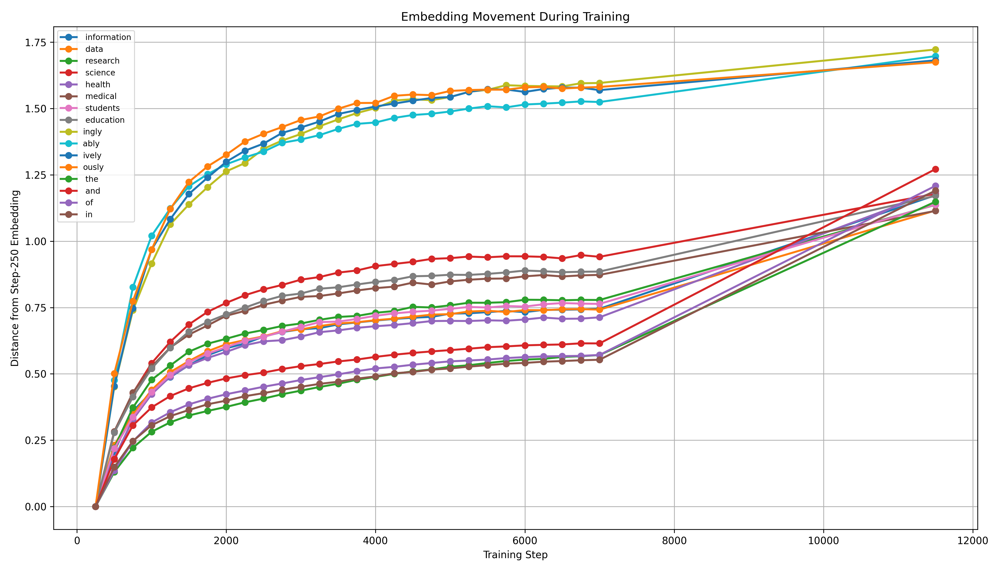
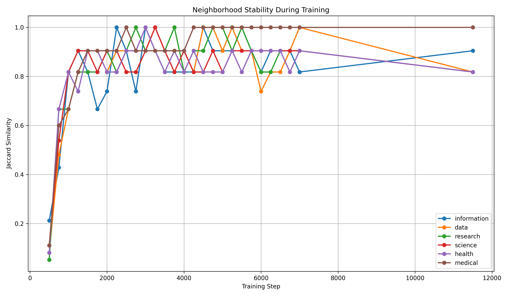
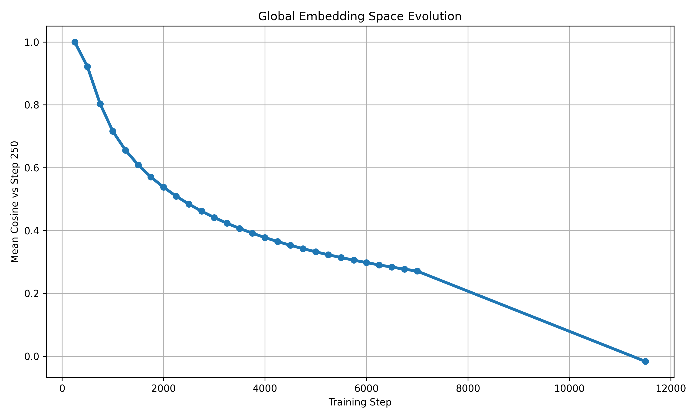

# Learned Embeddings: Semantic Geometry in GPT-2

## Overview

Large Language Models learn a vector representation (embedding) for every token in their vocabulary. These embeddings are often visualized after training, but an important question remains:

> How does semantic structure emerge during training?

This project investigates the geometry of GPT-2 token embeddings trained on FineWeb-Edu and analyzes:

- How semantic clusters form
- Which tokens receive large embedding norms
- The relationship between token frequency and embedding magnitude
- Whether embeddings reflect contextual similarity
- How semantic neighborhoods evolve during training
- What the model learns first

Rather than studying embeddings as static vectors, this project treats them as a dynamic system that gradually organizes language into meaningful geometric structure.

---

## Dataset

Training and analysis were performed using:

- FineWeb-Edu (sample-10BT)
- First 60 tokenized shards used for large-scale frequency and context analysis
- GPT-2 tokenizer
- Vocabulary size: 50,257 tokens

---

## Training Setup

### Bigram Model

A simple bigram language model was first trained to study how embedding geometry emerges in a minimal setting.

### GPT-2

- GPT-2 (124M parameters)
- Learned token embeddings (`transformer.wte.weight`)
- Checkpoints saved every 250 steps

Analyzed checkpoints:

```text
250
500
750
...
7000
11500
```

This allows direct observation of embedding evolution throughout training.

---

# Experiment 1: Bigram Embeddings

### Motivation

Before analyzing GPT-2, we first investigate whether meaningful geometry emerges in a much simpler model.

### Result



### Observation

Initially, token embeddings are random.

After training:

- Tokens organize into structured regions
- Frequently co-occurring characters become neighbors
- Non-random geometry emerges purely from prediction

This serves as a baseline for understanding more complex GPT-2 behavior.

---

# Experiment 2: Semantic Clustering

Selected semantic concepts:

### Information

- information
- data
- database
- evidence

### Research

- research
- science
- study

### Health

- health
- medical
- wellness
- disease

### Education

- students
- education
- school
- learning

PCA projection:



### Observation

Clear semantic clustering emerges:

- Information-related concepts occupy nearby regions
- Health concepts form a separate cluster
- Education concepts form another cluster

Embedding space is not random.

Semantic meaning becomes encoded geometrically.

---

# Experiment 3: Context Similarity vs Embedding Similarity

### Hypothesis

Tokens appearing in similar contexts should learn similar embeddings.

### Method

For selected concepts:

1. Build context vectors from FineWeb-Edu
2. Compute context cosine similarity
3. Compute embedding cosine similarity
4. Compare both quantities

### Results

Pearson Correlation = **0.623**

Examples:

```text
information ↔ data
context similarity = 0.973
embedding similarity = 0.514

health ↔ medical
context similarity = 0.968
embedding similarity = 0.487

research ↔ science
context similarity = 0.972
embedding similarity = 0.375
```

### Observation

Embedding geometry strongly reflects contextual statistics.

Tokens that occur in similar contexts move toward each other in embedding space.

---

# Experiment 4: Frequency vs Embedding Norm

### Question

Do common tokens receive larger embeddings?

### Result



Pearson **r = -0.401**

### Observation

The opposite occurs.

Rare tokens tend to have larger embedding norms.

Examples of high-norm tokens:

```text
selves
lihood
lessly
ingly
ably
ively
```

Examples of low-norm tokens:

```text
22
23
35
40
200
```

### Interpretation

Rare and specific tokens require stronger representations.

Common tokens are often compressed into smaller regions of embedding space.

---

# Experiment 5: Surprisal vs Embedding Norm

Surprisal is defined as:

\[
-\log p(token)
\]

### Result



Pearson **r = +0.401**

### Observation

Unexpected tokens tend to have larger embedding norms.

This is the inverse perspective of the frequency experiment.

Rare tokens receive stronger representations.

---

# Experiment 6: High-Norm Token Analysis

Top norm tokens:

```text
ingly
ably
ively
ously
edly
```

### Observation

Many high-norm tokens are productive linguistic suffixes.

These suffixes appear across thousands of words and may function as reusable morphological building blocks.

Other examples:

```text
twitter
tumblr
adobe
Getty
pedia
```

Distinctive concepts often occupy larger regions of embedding space.

---

# Experiment 7: Neighborhood Density

### Question

Are large-norm tokens isolated?

### Result



```text
Pearson = 0.142
Spearman = 0.174
```

### Observation

Only a weak relationship exists.

Large norms do not simply correspond to isolated tokens.

Embedding magnitude captures more than local density.

---

# Experiment 8: Semantic Directions

Vector arithmetic was analyzed using directions such as:

```text
medical - health
research - science
students - education
```

### Observation

Meaningful semantic directions emerge naturally.

Vector differences encode conceptual relationships rather than individual words.

---

# Experiment 9: Comparing Semantic Directions

Pairwise cosine similarity between directions:

```text
medical-health      research-science    0.0408
medical-health      students-education  0.0459
medical-health      data-information    0.0212
research-science    students-education  0.0637
research-science    data-information    0.0059
students-education  data-information    0.1144
```

### Observation

Most directions are nearly orthogonal.

Different semantic relationships occupy independent dimensions.

---

# Experiment 10: Emergence of Semantic Structure During Training

Tracked cosine similarity through training.

Pairs:

```text
information ↔ data
research ↔ science
health ↔ medical
students ↔ education
```



### Observation

Most semantic structure appears surprisingly early.

Strong relationships emerge within the first few thousand optimization steps.

Examples:

```text
information ↔ data      ≈ 0.51
health ↔ medical        ≈ 0.49
research ↔ science      ≈ 0.38
```

The model learns semantic similarity before training completes.

---

# Experiment 11: Embedding Movement During Training

Measured distance from the initial embedding at step 250.



### Observation

Embeddings continue moving throughout training.

Semantic stabilization does not imply convergence.

Tokens keep adapting even after neighborhoods become stable.

---

# Experiment 12: Neighborhood Stability

Tracked the top-10 nearest neighbors of selected concepts.

Similarity measured using Jaccard overlap.



### Observation

Neighborhoods stabilize extremely early.

Most tokens achieve:

```text
Jaccard Similarity > 0.8
```

within the first few thousand training steps.

Semantic neighborhoods form long before training finishes.

---

# Experiment 13: Global Embedding Space Evolution

Measured mean cosine similarity between embeddings at each checkpoint and the initial checkpoint.



### Observation

The embedding space never stops changing.

Although local semantic neighborhoods stabilize early, the global geometry continues evolving.

This suggests a two-stage learning process:

### Stage 1 — Semantic Organization

- Semantic clusters form
- Nearest neighbors stabilize
- Semantic directions emerge

### Stage 2 — Geometric Refinement

- Entire embedding space continues evolving
- Embeddings keep moving
- Local semantics remain largely preserved

---

# Key Findings

### Semantic structure emerges very early

Most meaningful relationships appear within the first few thousand optimization steps.

### Context drives geometry

```text
Context Similarity ↔ Embedding Similarity

Pearson r = 0.623
```

### Rare tokens receive larger embeddings

```text
Frequency ↔ Norm

Pearson r = -0.401
```

### Unexpected tokens receive stronger representations

```text
Surprisal ↔ Norm

Pearson r = +0.401
```

### Semantic neighborhoods stabilize early

Neighbor overlap quickly approaches 0.8–1.0.

### Global geometry keeps evolving

Local semantics converge before the embedding space itself converges.

---

# Final Takeaway

This project suggests that GPT-style language models learn embeddings in two distinct phases:

## Phase 1: Semantic Structure Formation

- Contextually similar tokens become neighbors
- Clusters emerge
- Semantic directions form

## Phase 2: Geometric Refinement

- Embeddings continue moving
- Global geometry evolves
- Local semantic organization remains stable

Embedding spaces are therefore not static lookup tables.

They are evolving geometric representations that gradually organize language into meaningful structure during training.