# Multi-Head Attention

## Why Do We Need Multi-Head Attention?

What's the difference between single-head attention and multi-head attention?

In the case of single-head attention, we do the following (a simple explanation — note that I am not including the bias, just considering the weight matrices):

We have the input `x(B, T, C)` into the self-attention block. We have three matrices `Wq(C, C)`, `Wk(C, C)`, `Wv(C, C)`:

```
Q = x @ Wq
K = x @ Wk
V = x @ Wv
attention matrix = softmax(Q.K^T / sqrt(d)) @ V  (output: B, T, C — same as input shape)
```

Now, in the case of single-head attention, we only have one attention matrix. So even if a token, say `a`, needs to attend to both tokens `b` and `c` (as both are important for next-token prediction), their effect gets averaged in the single-head case. This is roughly what the *"Attention is All You Need"* paper describes. They quote:

> *"Multi-head attention allows the model to jointly attend to information from different representation subspaces at different positions. With a single attention head, averaging inhibits this."*

---

## Two-Head Attention: A Walkthrough

Let's see what happens in two-head attention. We have the input `x(B, T, C)` into the self-attention block, and we compute the same three matrices:

```
Q = x @ Wq
K = x @ Wk
V = x @ Wv
```

Now we compute two attention matrices and then finally concatenate them. Let's see how we do this. We have Query of shape `(B, T, C)`, Key of shape `(B, T, C)`, and Value of shape `(B, T, C)`.

We split the key, query, and value into two parts. How do we do that?

```python
Q = Q.view(B, T, 2, C // 2)
```

Let's understand exactly what happens with a concrete example. Say `B=2`, `T=4`, `C=8`.

The initial `Q` looks something like this:

```
tensor([[[-1.02,  0.43,  0.51,  1.04,  1.21, -1.83, -0.47, -0.57],
         [ 0.75, -1.30, -1.42,  1.51,  0.13, -0.94,  0.06,  1.53],
         [ 2.70, -0.22,  1.52,  1.14, -0.23,  0.76,  0.22, -0.28],
         [ 0.14,  0.46,  0.14,  0.11, -1.23, -0.17,  0.37,  0.28]],

        [[ 0.58,  0.28,  0.16,  0.61,  0.09, -1.23, -1.75,  1.33],
         [-0.27,  1.45, -0.20, -0.85, -0.08, -0.71,  0.73,  1.61],
         [ 0.58,  2.05, -0.10, -1.43,  1.02, -0.28,  2.60, -0.01],
         [ 1.64,  0.11, -0.97, -0.55, -0.83, -0.68,  0.64, -0.32]]])
```

To clarify: `B=2` means two simultaneous batches of tokens, `T=4` means each batch contains 4 tokens, and `C=8` means the embedding dimension of each token. The first row in each batch corresponds to the query vector of the first token, the second row corresponds to the query vector of the second token, and so on.

---

### Single-Head Case

Let's first see the general (single-head) case. We have `Q` as above, and `K` as follows. The first row in each batch represents the key vector of the first token, and similarly for others:

```
tensor([[[-1.03,  1.11, -0.08,  1.05, -0.53, -1.20,  0.20, -1.72],
         [ 0.89,  0.19,  0.96, -0.25, -1.08, -1.22, -0.52,  1.48],
         [ 1.61,  0.49,  1.77, -2.45, -0.68,  0.29,  0.05, -0.49],
         [-0.64, -0.51, -1.08,  1.46,  1.66,  1.91,  0.35,  0.32]],

        [[ 0.97,  2.27, -1.10,  0.01,  0.50,  0.35,  0.49,  1.61],
         [ 0.26,  0.85,  0.09, -0.44, -1.23, -0.03,  0.55,  1.49],
         [ 1.15,  0.69, -0.08, -0.74,  0.67, -2.81,  0.19,  1.06],
         [ 0.56,  2.27,  0.55, -0.57,  0.99,  0.47, -0.15,  1.92]]])
```

In the attention equation we compute `Q.K^T`, so let's take the transpose of `K`. Here we rearrange so that the columns represent the key vector of each token. When we do `Q.K^T`, we are attending a key vector against all query vectors:

```
K^T:
tensor([[[-1.03,  0.89,  1.61, -0.64],
         [ 1.11,  0.19,  0.49, -0.51],
         [-0.08,  0.96,  1.77, -1.08],
         [ 1.05, -0.25, -2.45,  1.46],
         [-0.53, -1.08, -0.68,  1.66],
         [-1.20, -1.22,  0.29,  1.91],
         [ 0.20, -0.52,  0.05,  0.35],
         [-1.72,  1.48, -0.49,  0.32]],

        [[ 0.97,  0.26,  1.15,  0.56],
         [ 2.27,  0.85,  0.69,  2.27],
         [-1.10,  0.09, -0.08,  0.55],
         [ 0.01, -0.44, -0.74, -0.57],
         [ 0.50, -1.23,  0.67,  0.99],
         [ 0.35, -0.03, -2.81,  0.47],
         [ 0.49,  0.55,  0.19, -0.15],
         [ 1.61,  1.49,  1.06,  1.92]]])
```

We get (neglecting the scaling factor here):

```
tensor([[[ 5.02, -0.27, -4.17, -0.44],
         [-2.09,  1.91, -6.74,  2.85],
         [-2.22,  2.32,  4.67, -0.55],
         [ 0.93,  2.07,  1.09, -2.47]],

        [[ 1.90,  1.06,  4.98,  3.04],
         [ 5.89,  4.45,  5.12,  6.09],
         [ 6.99,  2.70,  5.11,  6.22],
         [ 2.07,  1.59,  3.59, -0.90]]])
```

This is `Q.K^T`. After applying the mask and softmax, we get:

```
tensor([[[1.00, 0.00, 0.00, 0.00],
         [0.02, 0.98, 0.00, 0.00],
         [0.00, 0.09, 0.91, 0.00],
         [0.19, 0.58, 0.22, 0.01]],

        [[1.00, 0.00, 0.00, 0.00],
         [0.81, 0.19, 0.00, 0.00],
         [0.86, 0.01, 0.13, 0.00],
         [0.16, 0.10, 0.73, 0.01]]])
```

So we got two attention matrices — wait, two attention matrices in single-head attention? Just kidding. We got only a single attention matrix per sequence (4 tokens in this case). Overall we got two attention matrices for two sequences (`B=2`). Multi-head attention means we get *multiple* attention matrices *per sequence*. Let's see that next.

---

### Splitting into Two Heads

Now let's split `Q` using `Q.view(B, T, 2, C // 2)`:

```
tensor([[[[-1.02,  0.43,  0.51,  1.04],
          [ 1.21, -1.83, -0.47, -0.57]],

         [[ 0.75, -1.30, -1.42,  1.51],
          [ 0.13, -0.94,  0.06,  1.53]],

         [[ 2.70, -0.22,  1.52,  1.14],
          [-0.23,  0.76,  0.22, -0.28]],

         [[ 0.14,  0.46,  0.14,  0.11],
          [-1.23, -0.17,  0.37,  0.28]]],


        [[[ 0.58,  0.28,  0.16,  0.61],
          [ 0.09, -1.23, -1.75,  1.33]],

         [[-0.27,  1.45, -0.20, -0.85],
          [-0.08, -0.71,  0.73,  1.61]],

         [[ 0.58,  2.05, -0.10, -1.43],
          [ 1.02, -0.28,  2.60, -0.01]],

         [[ 1.64,  0.11, -0.97, -0.55],
          [-0.83, -0.68,  0.64, -0.32]]]])
```

Observe that previously the query vector of each token had length 8, but here we are splitting it across two heads — so each head gets some dimensions to work with. Let's do the same thing for the key vector:

```
tensor([[[[-1.03,  1.11, -0.08,  1.05],
          [-0.53, -1.20,  0.20, -1.72]],
         ...
        ]])
```

Now `Q` and `K` are of size `(2, 4, 2, 4)`. We want each head to work across the token dimension, so let's swap dimensions 1 and 2 for `Q` and `K` (we do the same for the value vector too, though I'm not covering that here since it's not required to compute the attention matrix).

`Q.transpose(1, 2)`:

```
tensor([[[[-1.02,  0.43,  0.51,  1.04],
          [ 0.75, -1.30, -1.42,  1.51],
          [ 2.70, -0.22,  1.52,  1.14],
          [ 0.14,  0.46,  0.14,  0.11]],

         [[ 1.21, -1.83, -0.47, -0.57],
          [ 0.13, -0.94,  0.06,  1.53],
          [-0.23,  0.76,  0.22, -0.28],
          [-1.23, -0.17,  0.37,  0.28]]],

        [[[ 0.58,  0.28,  0.16,  0.61],
          [-0.27,  1.45, -0.20, -0.85],
          [ 0.58,  2.05, -0.10, -1.43],
          [ 1.64,  0.11, -0.97, -0.55]],

         [[ 0.09, -1.23, -1.75,  1.33],
          [-0.08, -0.71,  0.73,  1.61],
          [ 1.02, -0.28,  2.60, -0.01],
          [-0.83, -0.68,  0.64, -0.32]]]])
```

After `K.transpose(-1, -2)` so that columns represent the key vectors, we compute the attention matrix `Q.K^T` and after masking and softmax, we get:

```
tensor([[[[1.00, 0.00, 0.00, 0.00],
          [0.69, 0.31, 0.00, 0.00],
          [0.00, 0.35, 0.65, 0.00],
          [0.31, 0.26, 0.29, 0.14]],

         [[1.00, 0.00, 0.00, 0.00],
          [0.01, 0.99, 0.00, 0.00],
          [0.28, 0.11, 0.61, 0.00],
          [0.17, 0.61, 0.21, 0.01]]],


        [[[1.00, 0.00, 0.00, 0.00],
          [0.85, 0.15, 0.00, 0.00],
          [0.85, 0.05, 0.10, 0.00],
          [0.54, 0.06, 0.33, 0.07]],

         [[1.00, 0.00, 0.00, 0.00],
          [0.43, 0.57, 0.00, 0.00],
          [0.39, 0.09, 0.52, 0.00],
          [0.07, 0.40, 0.50, 0.02]]]])
```

We now have **two attention matrices per sequence** — different attention matrices attend differently to tokens. Basically, each head learns different patterns, as described in the paper. We'll verify whether that's actually true later.

---

### Concatenating the Heads

Now we have this attention matrix of shape `[2, 2, 4, 4]` — the original shape was `[2, 4, 8]`. Remember that we moved the heads outside earlier (so each head could work across tokens). We now need to move the tokens back outside the heads before concatenating.

`attention_matrix.transpose(1, 2)`:

```
tensor([[[[1.00, 0.00, 0.00, 0.00],
          [1.00, 0.00, 0.00, 0.00]],

         [[0.69, 0.31, 0.00, 0.00],
          [0.01, 0.99, 0.00, 0.00]],

         [[0.00, 0.35, 0.65, 0.00],
          [0.28, 0.11, 0.61, 0.00]],

         [[0.31, 0.26, 0.29, 0.14],
          [0.17, 0.61, 0.21, 0.01]]],

        [[[1.00, 0.00, 0.00, 0.00],
          [1.00, 0.00, 0.00, 0.00]],

         [[0.85, 0.15, 0.00, 0.00],
          [0.43, 0.57, 0.00, 0.00]],

         [[0.85, 0.05, 0.10, 0.00],
          [0.39, 0.09, 0.52, 0.00]],

         [[0.54, 0.06, 0.33, 0.07],
          [0.07, 0.40, 0.50, 0.02]]]])
```

Now we have shape `(2, 4, 2, 4)`. Let's view it as `(2, 4, 8)` so the heads automatically get concatenated (their outputs concatenate in order: `head 0 | head 1 | head 2 | ...`). We'll be ablating this later, so keep it in mind.

We get (again, keeping in mind we skipped the multiplication with `V`):

```
tensor([[[1.00, 0.00, 0.00, 0.00, 1.00, 0.00, 0.00, 0.00],
         [0.69, 0.31, 0.00, 0.00, 0.01, 0.99, 0.00, 0.00],
         [0.00, 0.35, 0.65, 0.00, 0.28, 0.11, 0.61, 0.00],
         [0.31, 0.26, 0.29, 0.14, 0.17, 0.61, 0.21, 0.01]],

        [[1.00, 0.00, 0.00, 0.00, 1.00, 0.00, 0.00, 0.00],
         [0.85, 0.15, 0.00, 0.00, 0.43, 0.57, 0.00, 0.00],
         [0.85, 0.05, 0.10, 0.00, 0.39, 0.09, 0.52, 0.00],
         [0.54, 0.06, 0.33, 0.07, 0.07, 0.40, 0.50, 0.02]]])
```

---

## Experiments on GPT-2 (124M)

In this project, I investigated whether heads are really learning different patterns, which heads are important, and what happens to the loss when we ablate a head. I used an already-trained GPT-2 (124M) model that I fine-tuned on the FineWeb-Edu dataset (12 layers, 12 heads) to study the heads.

### Attention Heatmaps

The simplest experiment to check whether heads are learning different patterns is to plot their attention heatmaps and see if they look similar.

Before plotting all 12 heads, let's look at a single head in an enlarged view:

## One-Head Attention Map

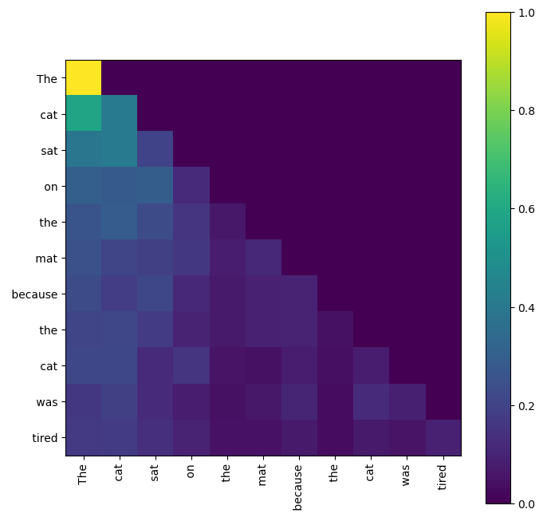

I used the text `"The cat sat on the mat because the cat was tired"`, tokenized it, and passed it through my trained model. The text is short so it's easier to observe patterns.

I started with the first layer and plotted the attention heatmaps of all 12 heads side by side:

## First Layer Attention Heatmaps

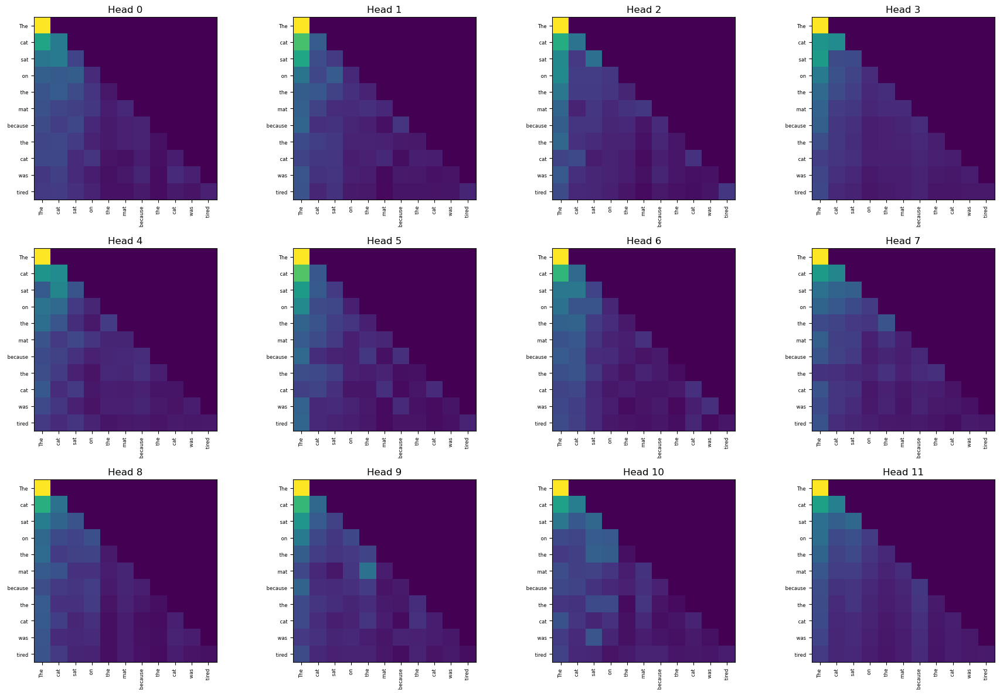

The heads were different, but the differences weren't very pronounced. So I plotted the attention heatmaps for the second layer:

## Second Layer Attention Heatmaps

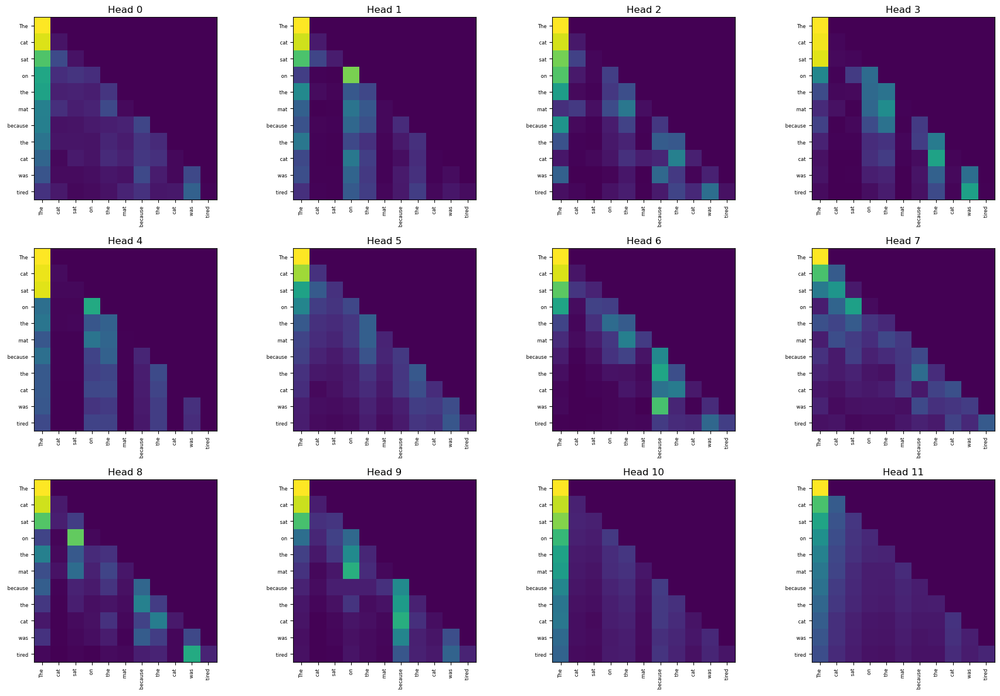

In the second layer the differences are much more visible. I think it's because as we go deeper, the heads get more specialised — they may not be that specialised in the early layers. (Might be!)

---

### Entropy of Attention Heads

Next, I calculated the entropy of each head to see how "spread out" each head's attention is. If a token attends equally to all tokens then the entropy is low, and if a token attends almost exclusively to a single token (with near-zero attention to others) then the entropy is high. For this I used a longer text:

> *"The scientist carefully examined the results of the experiment and noticed that several measurements differed from the original hypothesis. Although the data appeared noisy at first, further analysis revealed a consistent pattern across multiple trials. The researchers discussed possible explanations, compared their findings with previous studies, and concluded that additional experiments would be necessary to fully understand the underlying phenomenon."* (66 tokens)

As previously observed, the difference in heatmaps between heads in layer 1 wasn't very visible, and their entropies also lie in a similar range. Note that similar entropy doesn't mean identical attention heatmaps. For example, consider tokens `[a, b, c, d]`: in one case token `a` attends strongly to `b` and barely to `c` and `d`; in another case `a` attends strongly to `c` and barely to `b` and `d`. The entropy would be the same in both cases, but the attention heatmaps would differ.

I calculated the entropy of each head across all layers (12 × 12 = 144 values). In layer 5 (0-indexed), head 3 had an entropy of **0.0768**, which immediately drew my attention. I plotted the heatmap for that particular head:

## Attention Heatmap of Layer 5, Head 3

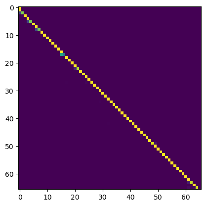

This is actually crazy — in this head's attention matrix, each token attends to *itself* very strongly. This is something clearly different. (The satisfaction of discovering something like this is real 😅)

For a better intuition, I also plotted the attention heatmap of another head in layer 5 with higher entropy — head 5:

## Attention Heatmap of Layer 5, Head 5

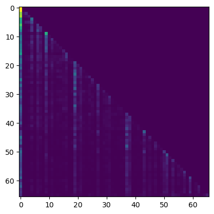

The difference is clearly visible!

---

### Head Similarity in Layer 5

Since layer 5 seemed interesting, I computed the pairwise similarity between all heads in that layer:

## Similarity Heatmap of Layer 5 Heads

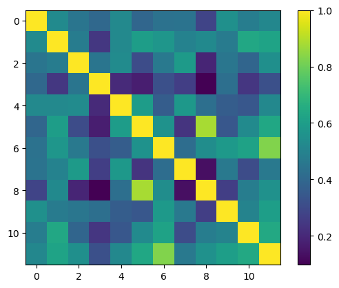

If similarity is close to 1, those two heads are extracting the same patterns — which is undesirable since multi-head attention is meant to extract *different* patterns. The similarity heatmap shows that most heads are not very similar to each other, confirming they are extracting different patterns.

There were two heads with notably high similarity (0.883). I plotted their attention heatmaps:

## Heatmap of Layer 5, Head 5


## Heatmap of Layer 5, Head 8

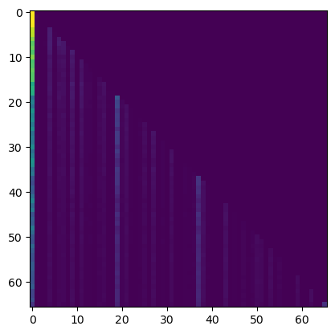

They are not identical, but you can see similar patterns — head 5 is slightly brighter than head 8's attention map, but the overall pattern is similar, which explains their high similarity score.

---

### Head Ablation

Since heads 5 and 8 were highly similar, would ablating either of them significantly change the loss? I ablated each head in layer 5 and observed the change in loss. The loss changed the most when I ablated **head 3** — the one with the strong diagonal (self-attention) pattern. This confirmed that it is the most important head in that layer.

Head 3 also had the lowest entropy in that layer. This led me to hypothesise that ablating a low-entropy head would have a higher impact on loss, while ablating a high-entropy head would have less impact. However, this held true for only some layers and not others, so no general statement can be made. All observations here are specific to this particular model and this particular example.

---

### Effect of Permuting Head Order

As mentioned earlier, heads are concatenated in a fixed order: `head 0 | head 1 | head 2 | ...`. During training, the projection matrix `c_proj` learns to expect this specific order. When I shuffled the order of heads in layer 5, the loss increased far more than when ablating any individual head:

- **Base loss (no change):** 3.1169
- **Loss after permuting head order:** 3.6186

That is a significant jump.

---

### Number of Heads vs. Perplexity

Next, I wanted to see whether a model trained with more heads performs better. I trained 6 different models, each with approximately 17M parameters, with 1, 2, 4, 8, 16, and 32 attention heads, on the TinyStories dataset. The perplexity decreased up until `num_heads=16` — the optimal point. Increasing the number of heads beyond this only increases the loss, because each head gets very few dimensions to work with.

## Scatter Plot: Perplexity vs. Number of Heads

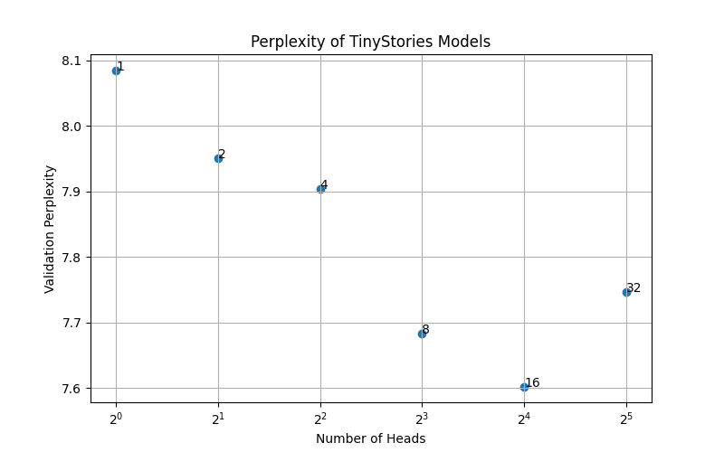

## Perplexity vs. Head Dimension

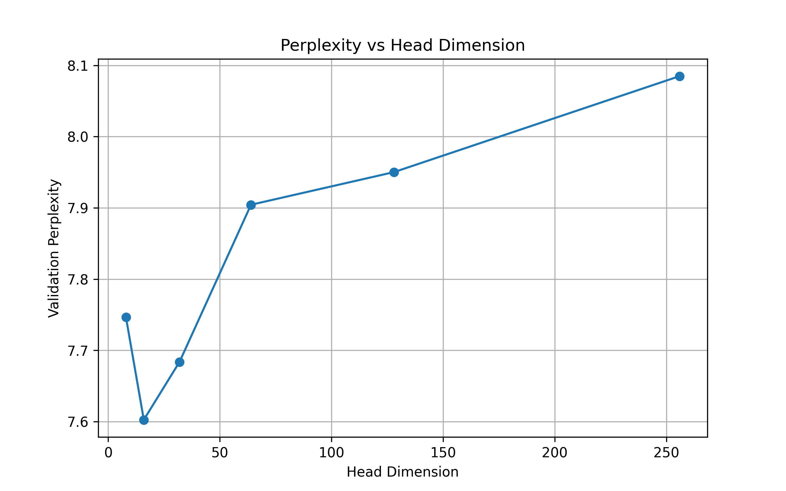

## Perplexity vs. Log of Attention Heads

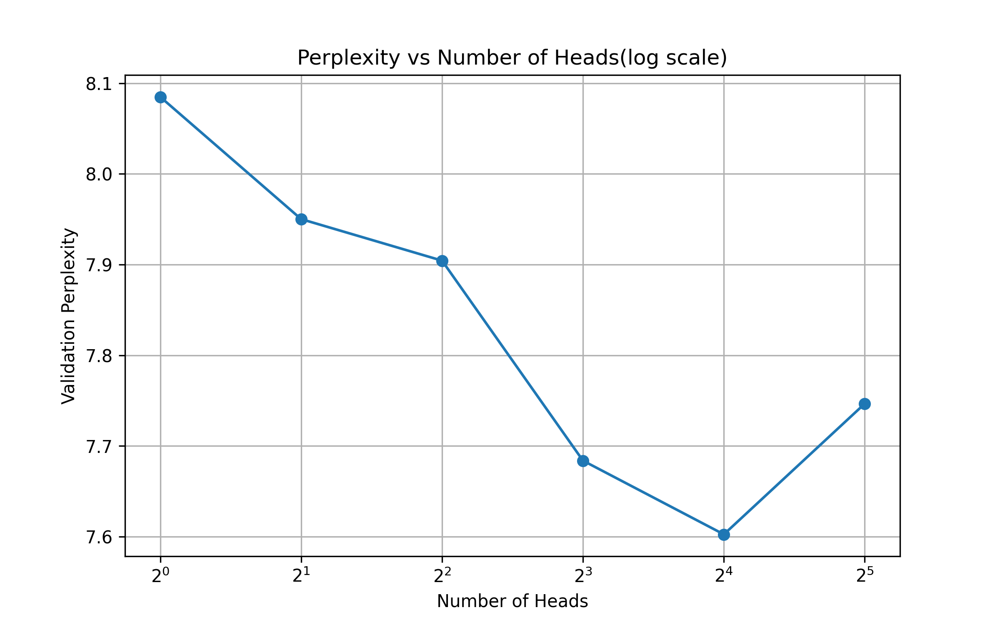

## Perplexity vs. Number of Attention Heads (Linear Scale)

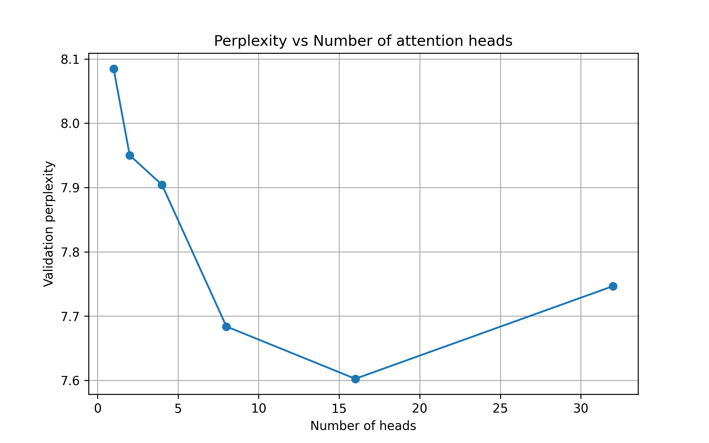

---

## Conclusion

From all these experiments, one can say that different heads are doing different jobs, and some heads are more important than others. In the next part, we'll build a single transformer block by stacking multi-head attention with residuals, layer norms, and an MLP.