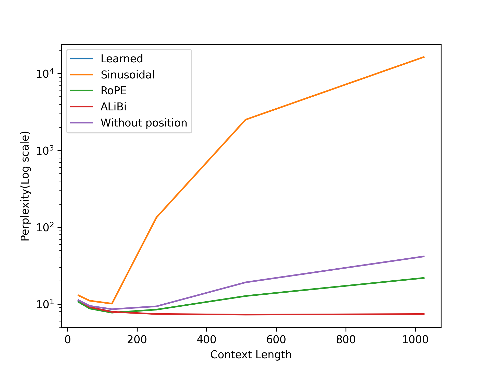
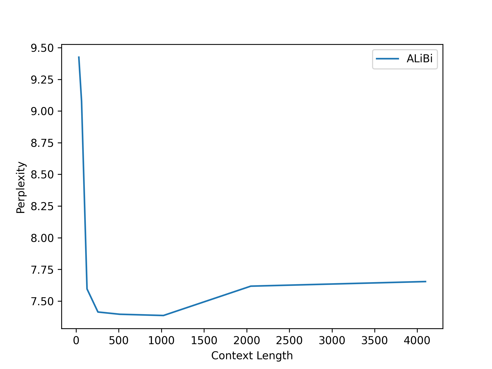

# positional-encoding-benchmarks

In this project, I explored different types of positional encoding methods used in transformer language models.

I know about **Sinusoidal Positional Encoding**, which was introduced in the paper *Attention Is All You Need*. I also have some experience with **Learned Positional Embeddings** from Karpathy's course. Previously, I trained a GPT-2-like model on the FineWeb-Edu dataset using learned positional embeddings.

I was very new to **RoPE** and **ALiBi**, although RoPE is commonly used in modern LLMs.

I read the research papers that introduced RoPE and ALiBi and wrote a blog about what I understood. You can read my Medium blog here: **https://medium.com/gopenai/learned-vs-sinusoidal-vs-rope-vs-alibi-which-positional-embedding-method-works-best-a94ce5638e64**

---

## Model Architecture

All models were trained using the same architecture:

```python
block_size = 128
vocab_size = 50257
n_layer = 4
n_head = 4
n_embd = 256
```

I trained each model for **10,000 steps** using:

- The same architecture
- The same dataset
- The same optimizer settings
- The same number of training steps

This allowed me to compare the positional encoding methods fairly.

I trained a small transformer on the TinyStories dataset using:

- Learned Positional Embeddings
- Sinusoidal Positional Embeddings
- RoPE
- ALiBi
- No Positional Encoding

(I will discuss why I trained a model without positional information later.)

---

# Training Loss Comparison

| Method | Train Loss | Validation Loss |
|----------|----------:|----------:|
| Without Position | 2.1295 | 2.1445 |
| Learned | 2.0689 | 2.0749 |
| Sinusoidal | 2.3032 | 2.3171 |
| RoPE | **2.0376** | **2.0544** |
| ALiBi | 2.0492 | 2.0640 |

According to these losses, the **Sinusoidal model** performed the worst and the **RoPE model** performed the best.

I expected the model without positional information to perform the worst, but these were the results I obtained. The results may depend on the dataset, so I do not know exactly why Sinusoidal performed the worst in this experiment. However, the best-performing model was RoPE, which is also what many modern LLMs use.

---

# Perplexity vs Context Length

I evaluated the perplexity of the model trained with **Learned Positional Embeddings** on context lengths of **32, 64, and 128**, since it cannot extrapolate beyond the training length.

### Learned Positional Embeddings

| Context Length | Perplexity |
|---------------:|-----------:|
| 32 | 10.8520 |
| 64 | 9.0538 |
| 128 | 7.9700 |

---

For **Sinusoidal**, **RoPE**, **ALiBi**, and **Without Position**, I evaluated context lengths of:

```text
32, 64, 128, 256, 512, 1024
```

### Sinusoidal Positional Embeddings

| Context Length | Perplexity |
|---------------:|-----------:|
| 32 | 12.9580 |
| 64 | 11.0478 |
| 128 | 10.1150 |
| 256 | 134.1046 |
| 512 | 2513.5290 |
| 1024 | 16430.3796 |

### RoPE

| Context Length | Perplexity |
|---------------:|-----------:|
| 32 | 10.6464 |
| 64 | 8.7438 |
| 128 | 7.7177 |
| 256 | 8.4632 |
| 512 | 12.7143 |
| 1024 | 21.8629 |

### ALiBi

| Context Length | Perplexity |
|---------------:|-----------:|
| 32 | 11.2478 |
| 64 | 9.1179 |
| 128 | 7.9080 |
| 256 | 7.4115 |
| 512 | 7.2756 |
| 1024 | 7.3979 |

### Without Positional Encoding

| Context Length | Perplexity |
|---------------:|-----------:|
| 32 | 11.2278 |
| 64 | 9.4606 |
| 128 | 8.5648 |
| 256 | 9.3359 |
| 512 | 19.1496 |
| 1024 | 41.6581 |

---

## Perplexity vs Context Length Graph

This graph shows **Perplexity vs Context Length** for different positional encoding methods.



I was quite surprised by the results.

- The model trained **without positional encoding** extrapolated better than the **Sinusoidal model**.
- **RoPE** extrapolated reasonably well.
- **ALiBi** was clearly the best at length extrapolation.

---

# ALiBi Length Extrapolation

I further tested the ALiBi model on context lengths of **2048** and **4096**, and the perplexity remained almost constant.

This was quite surprising.

I do not know exactly why modern LLMs use RoPE instead of ALiBi given these results, but I think extrapolation is not the only factor. RoPE-trained models may perform better in terms of overall quality, so extrapolation alone is probably not the deciding factor.



---

# Do We Even Need Positional Encodings?

While working on this project, I kept thinking about something.

We already use a **causal attention mask**, which ensures that a token can only attend to previous tokens and not future tokens.

Suppose we pass:

```text
[A, B, C]
```

Then:

```text
A can only attend to A
B can attend to A, B
C can attend to A, B, C
```

Now suppose we reorder them:

```text
[C, A, B]
```

Then:

```text
C can only attend to C
A can attend to C, A
B can attend to C, A, B
```

Even without explicit positional information, changing the order changes which tokens attend to which.

Also, if a token can attend to exactly two previous tokens, then it already has a clue that it is around position 2.

A transformer-based language model is learning extremely complex things. Couldn't it learn this simple positional signal as well?

I kept thinking about this and even argued with GPT about it for some time. Later, I found a paper called:

**"Transformer Language Models without Positional Encodings Still Learn Positional Information"**

I was surprised and started reading the abstract, hoping they would provide some other explanation. Instead, they proposed almost exactly the same intuition:

> "We conjecture that causal attention enables the model to infer the number of predecessors that each token can attend to, thereby approximating its absolute position. Our findings indicate that causal LMs might derive positional awareness not only from the explicit positioning mechanism, but also from the effects of the causal mask."

This is exactly what the paper mentions.

You can go through the paper if you are interested here : **https://arxiv.org/pdf/2203.16634**

---

# Final Thoughts

This project helped me understand positional encodings much more deeply than simply reading about them.

I implemented and trained models using:

- Learned Positional Embeddings
- Sinusoidal Positional Embeddings
- RoPE
- ALiBi
- No Positional Encoding

I compared their training performance, extrapolation behavior, and explored the role of the causal attention mask in learning positional information.

It was great fun doing this project.

# Let's go!! 🚀


