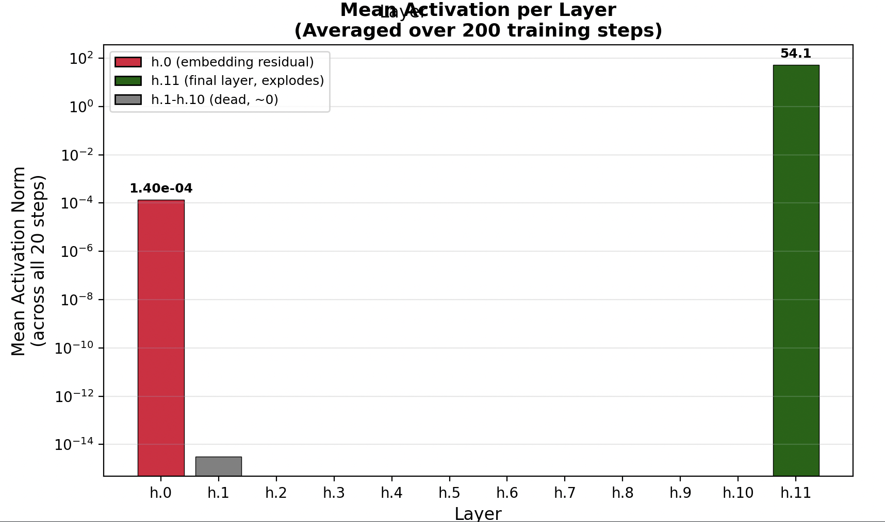
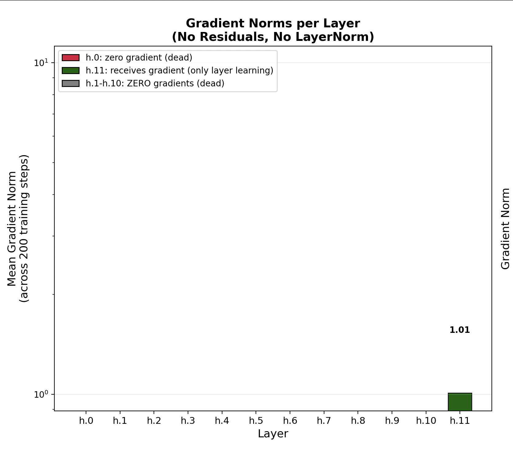
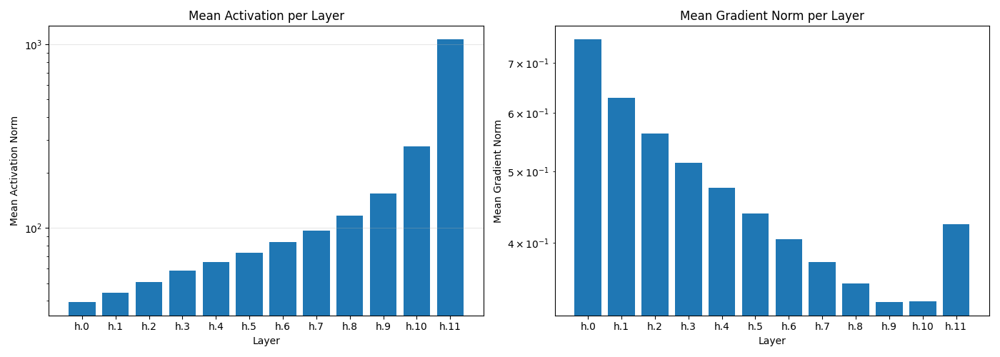
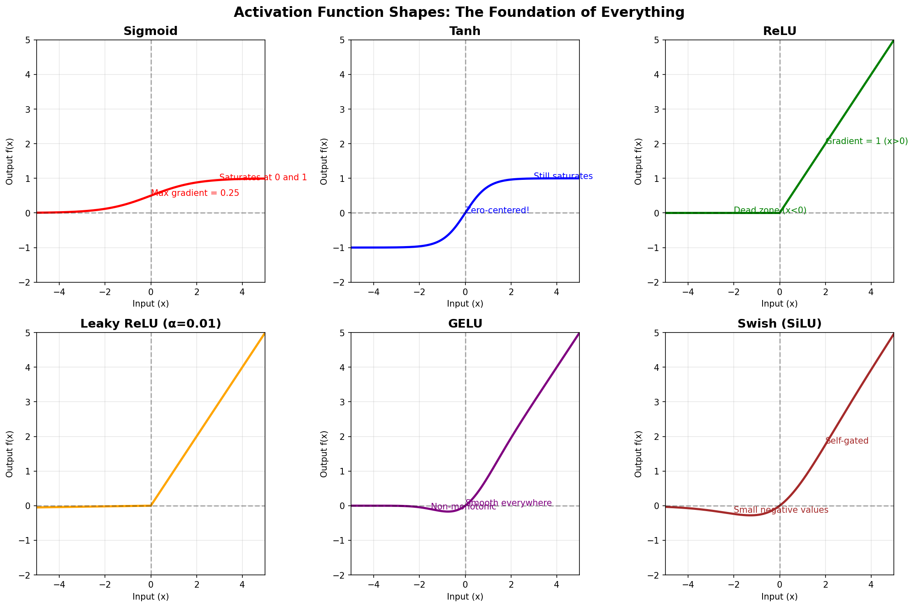
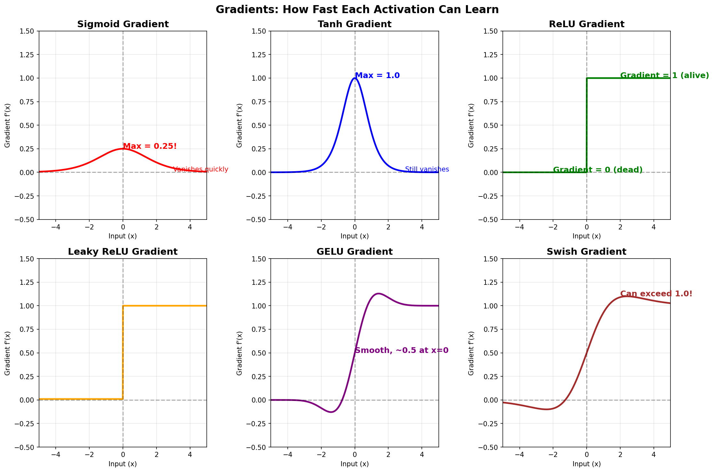
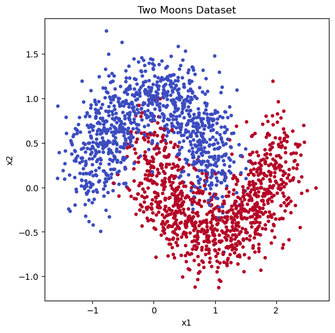
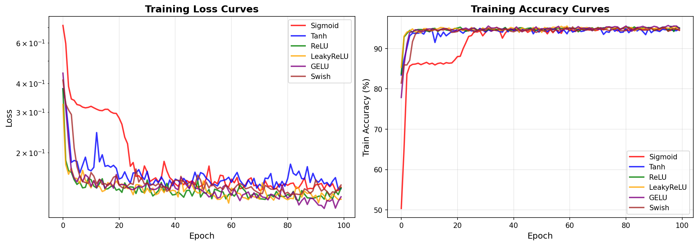
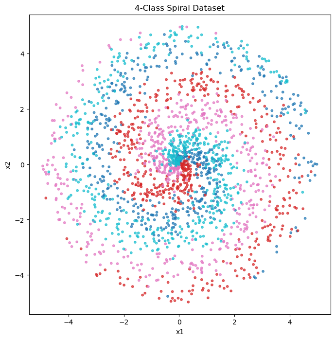
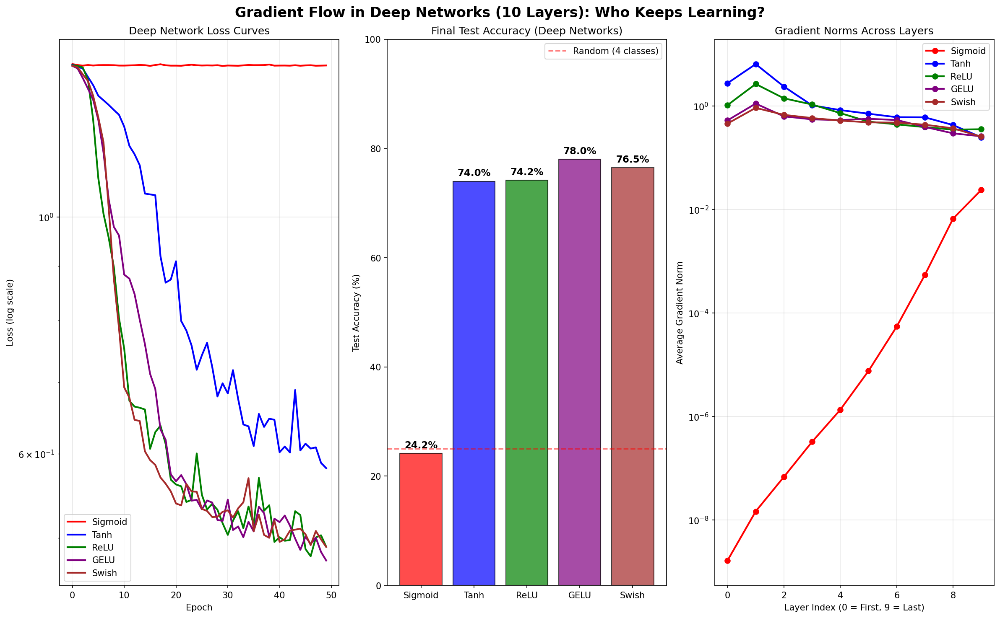

# Residuals, Normalizations, and Activation Functions in Deep Networks

## Residuals and Normalizations

To understand the role of residual connections and normalization in deep networks, I examined four cases:

1. Without residuals and without normalizations
2. With residuals and without normalizations
3. Without residuals and with normalizations
4. With residuals and with normalizations

The main aim was to observe the **per-layer activation norms** and **per-layer gradient norms** — both need to be healthy for a model to learn well. Observations were recorded every 10 steps up to 200 steps (20 observations total).

---

### Case 1: Without Residuals and Without Normalizations

In the first case, the activations die out after the first 1–2 layers. Interestingly, the last layer's activations are finite while all previous layers have zero activations. How is this possible?

Everything starts at zero since bias terms are initialized to zero. If the input dies after the first 1–2 layers and bias = 0, then the output of those layers must also be zero. However, observations are recorded *after* gradient updates. Since the last layers receive good enough gradients, their biases update from zero to some finite value. Even with a zero input, the bias term gets added, making the output of the last layer non-zero.

Here are the **per-layer activation norms** averaged across all 20 observations:



The **per-layer gradient norms** are all zero except for the last layer — the gradients die out:



The results are poor because **residual connections are the most fundamental component**. Every layer reads from and writes to the residual stream; without them, the input is completely overwritten after every layer. This is precisely why *Deep Residual Learning for Image Recognition* was such an influential paper.

---

### Case 2: With Residuals and Without Normalizations

In the second case, the per-layer activations keep increasing. This is expected: with residual connections, each layer's output is either equal to or larger than its input (since the layer output is *added* to the input), so activations can never shrink.

However, the activations grow very rapidly from the first layer to the last. For a 12-layer network, the last-layer activations are approximately 25× greater than the first-layer activations. Modern LLMs may use 96-layer networks, where activations would almost certainly explode without normalization.

For gradients: the per-layer gradient norms of the earlier layers are larger than those of the later layers when averaged across all steps. However, when examined at individual training steps, the behavior is highly erratic and appears almost random.



---

### Case 3: Without Residuals and With Normalizations

In the third case, the per-layer activations drift apart, with later-layer activations growing larger than earlier-layer ones.

For the per-layer gradient norms, two distinct phases emerge:
- **Early in training:** Earlier layers have larger gradient norms than later layers.
- **Later in training:** Normal behavior is observed — later layers have larger gradient norms while the gradients of earlier layers almost vanish.

---

### Case 4: With Residuals and With Normalizations

The fourth case — the setup used in modern LLMs — combines both components.

The per-layer activations still increase, but normalization prevents them from growing abnormally. Normalization allows activations to increase if it helps reduce the loss, but keeps them within a healthy range.

In Case 3, gradients of the very first layers were vanishing later in training. Here, gradient signal backpropagates cleanly all the way to the earlier layers, thanks to residual connections.

**Residual connections ensure effective gradient flow; normalization controls activation growth. Modern transformers require both to train deep networks successfully.**

---

### Summary and Key Takeaways

All four cases use the same architecture, initialization, learning rate, and number of steps. The best loss is achieved in Case 4.

| Case | Residuals | Normalization | Activations | Gradients | Loss |
|------|-----------|---------------|-------------|-----------|------|
| 1 | ✗ | ✗ | Die after 1–2 layers | Only last layer receives updates | Decreases slowly |
| 2 | ✓ | ✗ | Explode rapidly | Unstable across steps | Decreases |
| 3 | ✗ | ✓ | Drift apart | Vanish in early layers later in training | Decreases |
| 4 | ✓ | ✓ | Increase but controlled | Healthy throughout | Decreases most |

It is important to note that a *decreasing loss alone does not mean a healthy network*. In Case 1, the loss decreases, yet looking at the per-layer activation and gradient norms reveals that almost all layers have near-zero activations and dying gradients — only the last layer receives gradient updates. A 12-layer network is effectively behaving like a 2-layer network, with all middle layers contributing nothing.

> **Opinion:** The ideal setup is one where per-layer activations and per-layer gradients are both healthy *and* the loss decreases as much as possible. If a future algorithm can satisfy all three simultaneously to a greater degree, that would be the true sweet spot.

---

## Normalization: LayerNorm vs. RMSNorm

LayerNorm is applied individually on each token. Each token has its own embedding vector (e.g., 768 dimensions). Normalization sets the mean ≈ 0 and std ≈ 1. Since this fixed setting may not always be optimal, learnable **scaling** and **bias** factors are introduced — one per embedding dimension — so the network can adjust the statistics if needed.

**RMSNorm** applies only the scaling factor (std ≈ 1), skipping mean normalization. This reduces computation while achieving similar or better performance than LayerNorm, which is why RMSNorm is used in many modern LLMs.

---

## Pre-Norm vs. Post-Norm

Modern LLMs use **pre-norm** — applying normalization *before* passing input into the attention or MLP layers:

```
x = x + attn(norm(x))
```

The original Transformer paper used **post-norm**:

```
x = norm(x + attn(x))
```

Pre-norm is preferred because it allows gradients to flow directly through the residual path (`x`), without normalization interrupting the gradient signal. In post-norm, the normalization layer sits in the middle of the residual connection, impeding gradient flow.

---

## Activation Functions

Neural networks without activation functions can only learn linear functions. Activation functions introduce non-linearity, enabling networks to learn complex patterns.

### Functions Compared

| Activation | Formula |
|------------|---------|
| Sigmoid | `1 / (1 + e^{-x})` |
| Tanh | `(e^x - e^{-x}) / (e^x + e^{-x})` |
| ReLU | `max(0, x)` |
| Leaky ReLU | `max(αx, x)` |
| GeLU | `0.5x · (1 + tanh(√(2/π) · (x + 0.044715x³)))` |
| SwiGLU | `Swish(xW_g) ⊙ (xW_v)` |



**Gradients of these activation functions:**



---

### Experiment 1: Moderate Depth (4 Hidden Layers)

Architecture: `Input → [Linear → Act] × 4 → Output`

All settings (learning rate, epochs, initialization, task) are identical; only the activation function varies.

**Classification task:**



**Learning curves:**



Sigmoid learns noticeably slower than all others, followed by Tanh. ReLU, Leaky ReLU, GeLU, and SwiGLU learn at roughly similar speeds. The gap with Sigmoid is likely due to its maximum gradient being only 0.25 — the maximum learning signal is 4× weaker than that of Tanh or ReLU.

---

### Experiment 2: Deep Network with Vanishing Gradients (10 Hidden Layers)

A harder spiral classification task (4 classes) is used here to expose the vanishing gradient problem:



Plots: Loss vs. Epoch, Test Accuracy, and Average Gradient Norm vs. Layer.



**Observations:**

- **Sigmoid** fails to learn at all — its loss stays nearly constant. Its test accuracy falls below the random baseline of 25% for 4 classes.
- **Tanh** learns, but slower than ReLU, GeLU, and SwiGLU.
- **GeLU and SwiGLU** achieve the highest accuracy, supporting their widespread use in modern LLMs.
- For Sigmoid, the average gradient norm at Layer 0 is ~10⁻⁹ versus ~10⁻¹ at Layer 9 — a difference of ~8 orders of magnitude, clearly demonstrating the vanishing gradient problem.
- For all other activations, the gradient norms at Layer 0 and Layer 9 are comparable.

**Note:** A healthy gradient profile is necessary but not sufficient to call an activation function "good." ReLU, GeLU, and SwiGLU all have healthy gradients, yet their final performances differ. Other factors — such as how SwiGLU can dynamically suppress or retain features — also matter. Additionally, SwiGLU MLP blocks do not use bias terms.
