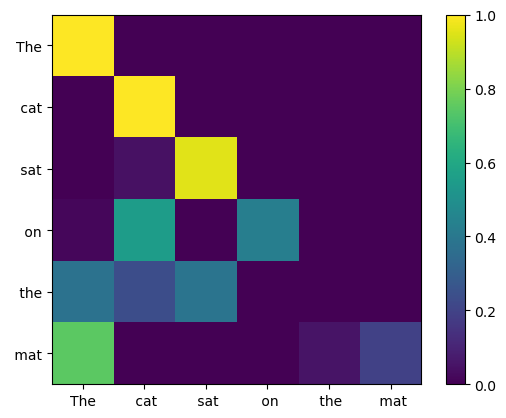

# Attention, Again!

In this project, I implemented attention... again!

It has been almost one or two years since I first learned about attention mechanisms and the famous **query, key, and value** vectors. Most explanations describe them as:

- **Query**: What am I looking for?
- **Key**: What can I provide?
- **Value**: What information can I provide if attended to?

But doesn't this feel a little artificial?

It often feels like these concepts appeared out of nowhere because a paper called *Attention Is All You Need* introduced the Transformer architecture. However, the story is much more interesting than that.

The Transformer is built around attention, but it also contains several other important components:

- Multi-Head Attention
- Feed-Forward Networks
- Layer Normalization
- Residual Connections
- Positional Encodings

Before Transformers, most sequence models were based on RNNs combined with attention mechanisms. The Transformer paper showed that attention alone could replace recurrence and achieve state-of-the-art performance.

Recently, I noticed something interesting:

> The entire AI industry was working to solve the machine translation problem, and in the process, knowingly or unknowingly, it also solved the language modeling problem.

Even *Attention Is All You Need* was originally a machine translation paper.

So let's go back and understand where the ideas of **query**, **key**, and **value** actually came from.

---

## The Evolution of Attention

```text
Seq2Seq
   ↓
Bahdanau Attention
   ↓
Memory Networks
   ↓
End-to-End Memory Networks
   ↓
Transformers
```

> Note: This is not necessarily the exact publication timeline. Connecting ideas across research papers is surprisingly difficult in AI because many concepts evolve in parallel.

The explanations below are intentionally simplified. For a deeper understanding, read the original papers:

- Sequence to Sequence Learning with Neural Networks  
  https://arxiv.org/pdf/1409.3215

- Neural Machine Translation by Jointly Learning to Align and Translate (Bahdanau Attention)  
  https://arxiv.org/pdf/1409.0473

- Memory Networks  
  https://arxiv.org/pdf/1410.3916

- End-to-End Memory Networks  
  https://arxiv.org/pdf/1503.08895

- Attention Is All You Need  
  https://arxiv.org/pdf/1706.03762

---

# Seq2Seq Models

Seq2Seq models used an RNN (or LSTM) based encoder-decoder architecture.

The encoder compresses the entire input into a single fixed-length vector, and the decoder uses this vector to generate the output sequence.

Consider the sentence:

```python
"The cat sat on the mat"
```

Tokenized as:

```python
x0="The"
x1="cat"
x2="sat"
x3="on"
x4="the"
x5="mat"
```

The encoder processes tokens sequentially:

```text
x0 + h0 → h1
x1 + h1 → h2
x2 + h2 → h3
...
x5 + h5 → h6
```

You can think of:

- `h1` as containing information about `"The"`
- `h2` as containing information about `"The cat"`
- `h3` as containing information about `"The cat sat"`

and so on.

After processing the full sequence, the final hidden state:

```text
h6
```

becomes the context vector:

```text
c = h6
```

---

## Decoder

The decoder starts with an initial hidden state:

```text
s0
```

Using the context vector `c`, it generates:

```text
y1
```

Then:

```text
s1 + c → y2
```

Then:

```text
s2 + c → y3
```

and so on until the sequence is generated.

---

## The Problem

The entire input sequence is compressed into a single fixed-length vector:

```text
c = h6
```

This creates a major bottleneck.

Even though the encoder produced:

```text
h1,h2,h3,h4,h5,h6
```

only `h6` is passed to the decoder.

This limitation becomes increasingly problematic as sequences grow longer.

---

# Bahdanau Attention

Bahdanau Attention solves this bottleneck.

Instead of using only:

```text
h6
```

the decoder can access all encoder hidden states:

```text
h1,h2,h3,h4,h5,h6
```

At each decoding step, the decoder computes a context vector dynamically.

Suppose we are generating:

```text
y3
```

using decoder hidden state:

```text
s2
```

A small feed-forward network computes similarity scores between:

```text
s2
```

and every encoder hidden state:

```text
h1,h2,h3,h4,h5,h6
```

After applying softmax:

```text
a1,a2,a3,a4,a5,a6
```

where:

```text
a1+a2+a3+a4+a5+a6=1
```

The context vector becomes:

```text
c_i = a1h1 + a2h2 + a3h3 + a4h4 + a5h5 + a6h6
```

---

## Sound Familiar?

This looks surprisingly similar to Transformer attention.

In modern terminology:

```text
Query = s2
Keys = h1,h2,h3,h4,h5,h6
Values = h1,h2,h3,h4,h5,h6
```

Notice something important:

> The keys and values are the same vectors.

This raises an interesting question:

**When did keys and values become separate?**

To answer that, we need Memory Networks.

---

# Memory Networks

Bahdanau Attention was designed for machine translation.

Memory Networks targeted a different problem:

> Question Answering

Consider the story:

```text
John went to the kitchen.
Mary went to the bedroom.
John picked up the milk.
John travelled to the garden.
```

Question:

```text
Where is the milk?
```

---

Memory Networks introduced the idea of **memory slots**.

```text
m1 = John went to the kitchen.
m2 = Mary went to the bedroom.
m3 = John picked up the milk.
m4 = John travelled to the garden.
```

Instead of storing information in hidden states, facts are stored explicitly in memory.

When a question is asked, the network searches through memory to retrieve relevant facts.

For example:

```text
Where is the milk?
```

The network may retrieve:

```text
m3 = John picked up the milk.
```

But this isn't enough.

We also need:

```text
m4 = John travelled to the garden.
```

Combining these facts gives the answer:

```text
Garden
```

---

## Limitation of Memory Networks

Memory Networks required supervision during training.

The model needed help learning which memory slots to retrieve.

This made end-to-end training difficult.

---

# End-to-End Memory Networks

End-to-End Memory Networks solved this issue.

Suppose memory slot `i` contains:

```text
John picked up milk
```

The model stores **two different embeddings**:

```text
m_i = A(sentence_i)
c_i = C(sentence_i)
```

where `A` and `C` are different embedding matrices.

---

Given question embedding:

```text
u
```

attention scores are computed using:

```text
u · m_i
```

Therefore:

```text
Query = u
Keys = m_i
```

But retrieved information comes from:

```text
c_i
```

Therefore:

```text
Values = c_i
```

This is one of the earliest examples of separating keys and values.

---

# Finally: Transformers

This project explores the origins of query, key, and value vectors.

I used the sentence:

```python
text = "The cat sat on the mat"
```

Using GPT-2 tokenization:

```python
tokens = [464, 3797, 3332, 319, 262, 2603]
```

I computed the query vector for the first token (`464`) and calculated attention scores against all key vectors **without** using the scaling factor:

```text
sqrt(d_k)
```

The resulting attention probabilities were:

```python
tensor([
  1.6981e-26,
  3.7277e-08,
  5.7860e-08,
  1.0000e+00,
  9.2905e-09,
  2.6289e-13
])
```

Notice how the softmax almost completely collapses onto a single token.

---

## Why Scaling Matters

The Transformer paper divides attention scores by:

```text
√d_k
```

to prevent dot products from becoming too large.

Large dot products produce large variances, which cause softmax to saturate.

Repeating the experiment with scaling enabled produced:

```python
[
  7.6923e-10,
  2.3483e-03,
  2.7432e-03,
  9.9344e-01,
  1.4369e-03,
  3.5429e-05
]
```

The distribution is still peaked, but much less extreme.

This demonstrates exactly why the scaling factor is important.

---

# Causal Masking

Attention is still not complete.

So far, every token can attend to every other token, including future tokens.

For autoregressive language modeling, this is not allowed.

Therefore, after computing:

```text
QKᵀ / √d_k
```

we apply a causal mask before softmax.

Future positions are assigned:

```text
-∞
```

which becomes:

```text
0
```

after softmax.

This prevents the model from looking into the future.


---

# Conclusion

This project was about:

- Understanding the origins of query, key, and value vectors
- Tracing the evolution from Seq2Seq to Transformers
- Understanding why keys and values became separate
- Exploring attention scores manually
- Breaking attention by removing the scaling factor
- Observing softmax saturation
- Understanding causal masking

In the next project, we'll explore:

> Why do we use Multi-Head Attention?

Until then, bye!
